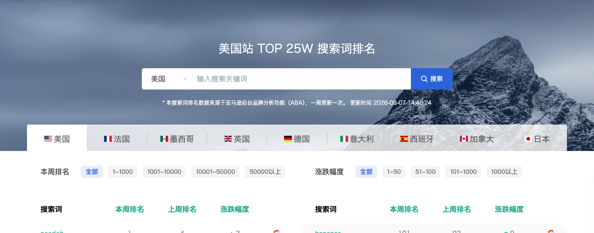
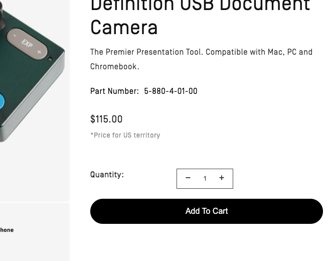
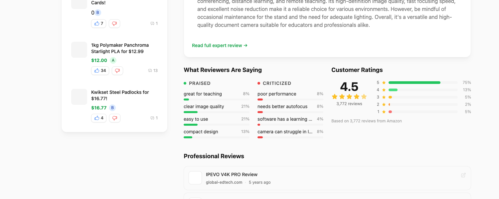
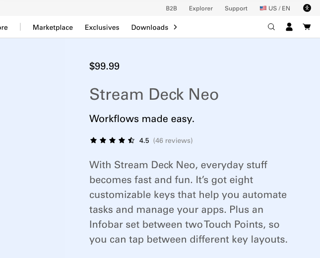
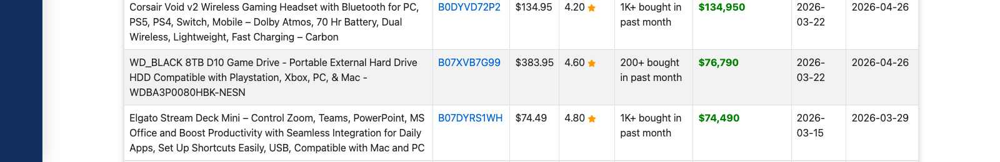
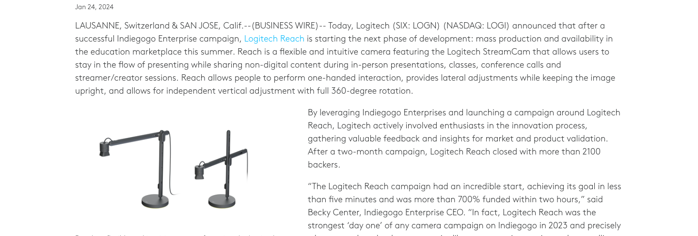
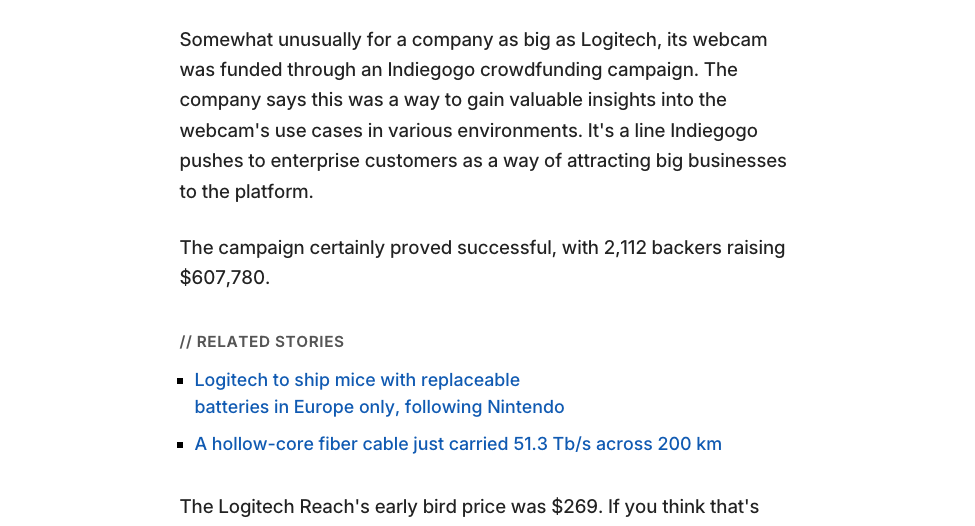

# 絮手亚马逊调研：数据快照附录 v1

> 对应报告：[絮手_亚马逊消费品机会调研_v1.md](./絮手_亚马逊消费品机会调研_v1.md)  
> 抓取日期：2026-08-11（Asia/Shanghai）  
> 用途：让报告里的关键数字可以逐条复核  
> 快照目录：[絮手_亚马逊调研证据快照_v1](./絮手_亚马逊调研证据快照_v1/)

## 一、怎样阅读这些证据

每条证据保留四层信息：来源网址、抓取时间、页面截图、页面正文文本。聚焦截图用于快速核对数字；完整截图和 `.txt` 文件用于查看上下文。

页面快照只能证明“抓取时页面显示了什么”。第三方页面中的 Amazon 月购量、价格和评论量属于历史货架快照，不能代表 Amazon 当前实时数据。

## 二、关键数字核对表

| 编号 | 报告中的数字／事实 | 快照里应查看的内容 | 来源性质 | 可用于什么结论 |
|---|---|---|---|---|
| E01 | AMZ123 美国站 Top 25 万搜索词来自 ABA；一周更新一次；页面更新时间为 2026-08-07 14:46:24 | 页面标题下方的一行说明 | AMZ123 页面 | 说明 AMZ123 数据口径和更新时间，不能证明某个具体关键词的销量 |
| E02 | IPEVO V4K 官网价格 $115 | 产品名称与 `$115.00` | 品牌官网 | 文档摄像头品牌价格锚点 |
| E03 | IPEVO V4K 的第三方聚合页显示 Amazon 3,772 条评论、均分 4.5 | `3,772 reviews`、`4.5`、`Based on ... Amazon` | 第三方评论聚合 | 证明产品有较大评论基数；评论数需回 Amazon 再做实时确认 |
| E04 | Stream Deck Neo 官网价格 $99.99；4.5 分、46 条评论 | 产品名称、价格、评分和评论数 | 品牌官网 | 实体快捷控制台的品牌价格锚点 |
| E05 | SellerSnooper 页面显示 Stream Deck Mini 为 $74.49、4.80 分、1K+ bought in past month；记录区间为 2026-03-15 至 2026-03-29 | 商品所在整行 | 第三方 Amazon 历史快照 | 证明实体快捷键品类存在较强货架信号；不能当作今日月销量 |
| E06 | Logitech 官方称 Reach 两个月众筹获得 2,100+ 名支持者；建议零售价 $349.99 | `more than 2100 backers`；完整正文另有 `$349.99` | 品牌官方新闻稿 | 证明创作者俯拍硬件有高价付费案例 |
| E07 | TechSpot 记录 Reach 有 2,112 名支持者、筹得 $607,780；早鸟价 $269，标准价 $349 | 两段原文 | 媒体报道 | 为官方的 2,100+ 人提供更具体的众筹金额与定价补证 |

## 三、逐条截图

### E01 — AMZ123 的数据来源与更新时间

- 来源：[AMZ123 美国站 Top 25 万搜索词](https://www.amz123.com/usatopkeywords)
- 页面显示：数据来源于 Amazon Brand Analytics（ABA），一周更新一次，更新时间 2026-08-07 14:46:24。
- 证据等级：平台页面。

- [完整页面截图](./絮手_亚马逊调研证据快照_v1/01_amz123_aba_keywords.png)
- [抓取正文](./絮手_亚马逊调研证据快照_v1/01_amz123_aba_keywords.txt)

### E02 — IPEVO V4K 官方价格

- 来源：[IPEVO V4K 官方商店](https://us.ipevo.com/products/v4k-store)
- 页面显示：$115.00。
- 证据等级：品牌官网。

- [完整页面截图](./絮手_亚马逊调研证据快照_v1/02_ipevo_v4k_official.png)
- [抓取正文](./絮手_亚马逊调研证据快照_v1/02_ipevo_v4k_official.txt)

### E03 — IPEVO V4K 的 Amazon 评论聚合快照

- 来源：[ShopSavvy：IPEVO V4K](https://shopsavvy.com/products/ipevo-v4k-document-camera)
- 页面显示：4.5 分，3,772 条评论，并标明 `Based on 3,772 reviews from Amazon`。
- 证据等级：第三方聚合；需要回 Amazon 实时页二次确认。

- [完整页面截图](./絮手_亚马逊调研证据快照_v1/03_ipevo_reviews_snapshot.png)
- [抓取正文](./絮手_亚马逊调研证据快照_v1/03_ipevo_reviews_snapshot.txt)

### E04 — Stream Deck Neo 官方价格与评论

- 来源：[Elgato Stream Deck Neo 官方页](https://www.elgato.com/us/en/p/stream-deck-neo)
- 页面显示：$99.99、4.5 分、46 条评论。
- 证据等级：品牌官网。

- [完整页面截图](./絮手_亚马逊调研证据快照_v1/04_stream_deck_neo_official.png)
- [抓取正文](./絮手_亚马逊调研证据快照_v1/04_stream_deck_neo_official.txt)

### E05 — Stream Deck Mini 的 Amazon 历史货架快照

- 来源：[SellerSnooper：Technology Galaxy Products by Revenue](https://www.sellersnooper.com/Technology%20Galaxy/productsByRevenue)
- 页面显示：ASIN B07DYRS1WH；$74.49；4.80 分；`1K+ bought in past month`；记录日期 2026-03-15 至 2026-03-29。
- 证据等级：第三方历史快照；不代表当前实时销量。

- [完整页面截图](./絮手_亚马逊调研证据快照_v1/06_stream_deck_mini_snapshot.png)
- [抓取正文](./絮手_亚马逊调研证据快照_v1/06_stream_deck_mini_snapshot.txt)

### E06 — Logitech Reach 官方众筹与定价

- 来源：[Logitech 官方新闻稿](https://news.logitech.com/press-releases/news-details/2024/Logitech-Reach-Flexible-Content-Camera-Now-Available-To-Order-Following-Unprecedented-Indiegogo-Campaign/default.aspx)
- 页面显示：两个月众筹结束时超过 2,100 名支持者；正文后段给出建议零售价 $349.99。
- 证据等级：品牌官方新闻稿。

- [完整页面截图](./絮手_亚马逊调研证据快照_v1/07_logitech_reach_official.png)
- [抓取正文](./絮手_亚马逊调研证据快照_v1/07_logitech_reach_official.txt)

### E07 — Logitech Reach 众筹金额与价格补证

- 来源：[TechSpot：Logitech Reach](https://www.techspot.com/news/101630-logitech-349-articulating-arm-webcam-great-streamers-creators.html)
- 页面显示：2,112 名支持者，筹得 $607,780；早鸟价 $269，标准价 $349。
- 证据等级：媒体报道；众筹人数与官方的“2,100+”相互印证。

- [完整页面截图](./絮手_亚马逊调研证据快照_v1/08_logitech_reach_crowdfunding.png)
- [抓取正文](./絮手_亚马逊调研证据快照_v1/08_logitech_reach_crowdfunding.txt)

## 四、未纳入硬证据的数字

### Amazon 文档摄像头历史推荐位

公开索引能读取一份 2025-04-11 的 Amazon 页面 PDF。其第 2 页显示多款文档摄像头约 $48.99–187，并出现 50+、300+、400+、500+ 的 `bought in past month` 标签。该 PDF 对自动下载返回 403，本轮未能保存本地原始文件和截图。

- 外部来源：[Amazon 页面历史 PDF](https://uspto.report/TM/99139436/APP20250416030103/3.pdf)
- 处理方式：保留为外部历史线索，不让这些月购数字单独支撑市场结论。

### 俯拍手机支架的月购数据

搜索索引曾显示 Evershop 俯拍支架约 $30.58、1K+ 月购，原 Amazon 页面本轮持续返回 503，无法保存可复核截图。

- 处理方式：从主报告的硬证据表中移除具体月购数字。俯拍支架的低价替代关系仍成立，但需要下一轮 Amazon 可访问时重新采集。

### Stream Deck Plus 的月购数据

Slickdeals 页面被 Cloudflare 验证页遮挡，无法形成有效截图。

- 处理方式：不使用该页面的 `2K+ bought in past month` 作为主证据；只保留 E04 和 E05。

### Reddit 用户讨论

Reddit 对无登录自动访问返回人机验证页，因此本地截图没有显示评论正文。原搜索索引可以作为访谈线索，当前报告不把这些帖子当作可量化市场证据。

## 五、真实性边界

1. 官方页面可以核对品牌自报价格、规格和众筹人数；它们依然可能后续更新。
2. ShopSavvy 和 SellerSnooper 属于第三方聚合，能够证明抓取时的页面陈述，无法代替 Amazon 后台数据。
3. `bought in past month` 是 Amazon 前台区间标签，粒度有限，也可能随时间变化。
4. 评论量、月购量和搜索排名只能证明相邻品类活跃，无法直接证明用户愿意购买“创作过程书签”。
5. 下一轮若要用于正式商业决策，应通过 Amazon Brand Analytics、SellerSprite／Helium 10 或 Seller Central 导出并保留原始 CSV。
